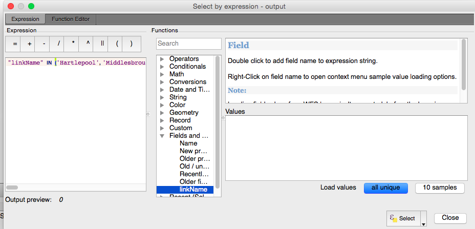
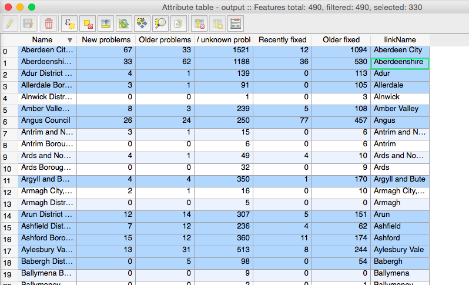

#Accessing open data
There is now a wealth of data available online. These come from a variety of sources (crowdsourced data, online transaction data, administrative data, and so on), and in many formats (csv file, xml or json files, or through application program interfaces (APIs)). You will often want to access such data, and use it for your own work or research. 

This tutorial will show you how to access data from the web using QGIS. We will write some python scripts (don't worry, you will only have to copy and paste) and also use some plugins available in QGIS. 

We will perform some web-scraping, for getting data from websites taking advantage of their HTML tags, and we will also be collecting tweets available through the twitter API.

This tutorial is meant to give you a flavour of how you can access data from online resources, and import it directly into QGIS. The code will be here for your reference, and this tutoarial will be available online [here](). If you have any questions later, do not hesitate to get in touch **reka.solymosi@manchester.ac.uk**

#Tools

The main tool we will be using is QGIS, and its plugins. However we will also be making use of some Python code to use within the QGIS environment. Python is the language on which QGIS is built, and many of the plugins you might use will have been written by people with such code. It's possible to write your own plugins, or to write scripts which you can automatically execute from within QGIS. Here I will be showing you the code directly for one exercise (web scraping) so that you can get a sense of what such a script would be doing, and how you can edit it to fit your needs. 


For those potentially unfamiliar with it Python is ...
[PUT IN SOME HISTORY]


You can write such code in many dedicated development environments, however for our purposes here, QGIS provides a built-in console where you can execute python code. This console is a quick way to learn scripting and do quick data processing. 


You can open the Python Console by going to Plugins > Python Console:


```{r, out.width = "600px", echo=FALSE}

```


This will open a little window, where you can paste the Python code from this tutorial, or write your own. While no programming experience is required (or taught really) here, I will describe each bit of code that we use in detail, so that you have an understanding of what you are doing, why, and how you can change this if you wanted to implement it in your own work. 


##Writing your first bit of code


So to demistify this process for anyone who might not have written any code before, let's carry out a quick exercise. 


```{r, out.width = "400px", echo=FALSE}
knitr::include_graphics("hackCat.gif")
```


We will start with writing something super simple. I won't go into great detail here, but one of the basic units of writing any code is a variable. Put most simply, a variable is something that varies. You can call this variable anything (eg: height) and give it any value (163cm for example). But then, you can refer to this variable throughout your workflow, and it will hold all the values which you give it.  


In this first instance, we will create a variable the contains some text. In python you assign a value to a variable with the `=` sign. 

So here we will create a variable called *hello* and give it the value "hello world :)" because we're happy people. You can do this with the following code: 


```{python}
hello = "hello world :)"
```


Now you have assigned the value `hello world :)` to the variable called `hello`. Try pasting (or directly writing) this into the Python Console: 


```{r, out.width = "600px", echo=FALSE}
knitr::include_graphics("helloworld.gif")
```


Now this varaible, called `hello` is in your environment. 

Try what happens if you just type it's name (hello) into the console, to call it. 
You can now do anythinto the values in this variable, by referring to the variable name. 

[PUT IN EXAMPLE WITH GREPL OR CAPITALISE OR SOMETHING]

Congratulations you have just written your first bit of code! Woohoo!

***

#Setting up

One of the most important things to do before you start working is to create an organised workspace. It is important when you are downloading data from the web that you know where these data get saved. And when you are reading in data to QGIS, again it's good practice to point QGIS in the right direction to read those data from.


##Setting up a working directory
So firstly, before we begin to do any work, we should create our **working directory**. This is simply a folder where you will save all our data, and also where you will be reading data in from. You can create a new folder, where you will save everything for this project, or you can choose an existing folder. It's advised that you create a folder, and also give it some name you remember, that will be meaningful. Generally try to avoid spaces and special characters in folder (and file) names. It's not necessarily a good idea to just dump everything into 'Desktop' either, as you want to be able to find things later, and maybe keep things tidy. 


Anyway, once you have a folder identified, you will need to know the *path* to this folder. That is the route that you will be using in your code to read/write files from/to the right directory. Often you will get errors, about certain things "not found" due to incorrect file paths. So it's important that we find the correct path. There are multiple ways of finding the correct path for both macs and PCs (and Linux but if you are a Linux user then I will assume you should already know all this...!). I will give an example for a mac and one for a PC here.

On a mac you can find the path to a specific file or folder by first opening Terminal, then opening Finder and navigating to the folder or file in Finder. Once you have found it, just drag and drop the folder or file it into the Terminal window. This will print out the path to your file or folder:


```{r, out.width = "600px", echo=FALSE}

```


On a PC, you can fing a path to a file or folder by navitgating to it using [file explorer] and once there, copying the file path from the top bar. This is illustrated by the red circle below:


```{r, out.width = "600px", echo=FALSE}

```


NOTE: When you copy this file path from the PC version, you will have to change the direction of the dashes, when passing this as a text string to a variable in Python. So you will have to replace all backslash (`\`) with forwardslash (`/`).

For example: 
`C:\Users\mesike\Desktop\dokumentumok`
should become
`C:/Users/mesike/Desktop/dokumentumok`

Once you have this path, we will use this to create a new variable, that will contain the text value of your path. To do this, you are essentially repeating what we did with the *hello world* exercise. 

You can see below I have provided you a template, where I create a variable called *my_path* using my filepath that I retreived: 


```{python, eval = FALSE}
my_path = "/Users/reka/Desktop/openDataTut"
```

You can copy the above into a text editor, and then within there replace the path with the one that is relevant to you. Make sure it's all inside the quotation marks ("") and that there is no space on either end. 

NOTE: Be careful with your choice of text editor though because some text editors mess about with quotation marks. If you are using a text editor that is not created for writing code, or somehow uses non UTF-8 characters [link about whta that is]() then you might encounter an error when you execute this code, telling you about an illegal character. If this happens, just delete and re-type the quotation marks within the QGIS python console. 

Anyway, create this variable called *my_path* by replacing my filepath above whith yours. Then run this in the QGIS python console, to create this variable. You can check that you have succeeded, and the value the variable currently holds, the same way we did in the hello world exercise. Just like we created the hello object to hold your text saying "hello world :)", we have now created this path object, to hold the path to your folder, where you will be saving everything. 

So now you have this my_path variable, and you can use it to set the working directry for this session. You can do this by copying and pasting the below code into the QGIS python console: 


```{python, eval=FALSE}

#import the os so you can make changes
import os 

#set path to the my_path variable we created earlier
path = my_path

#now change the directory (chdir() function) to this new path
os.chdir(path)

```


What you are doing here, is making sure that this folder is where we will be saving all the data, and also if we tell QGIS to read in some files, it will look for them in this folder as well. 


##Importing some modules

Python is great and versatile because it has many modules that people have created, which enable you to easily do certain operations. Basically, modules are bits of code, that someone has written to perform somethin specific. For example there is a module for graphing, there is a module for webscraping, and so on. The nice thing about these is that someone has written thes euseful functions, and we can just import the module and run these functions, without having to write the complicated stuff ourself. Further, because python is open source and anyone can contribute, there are many modules that correspond to pepople's many interests. You could write your own if you wanted to! 


Normally, to use a module, you have to download it onto your own computer beforehand. You can see [here](https://packaging.python.org/installing/) for some information about downloading modules for yourself on your PC. You will need to install something called pip, for which there is a quick tutorial [here](https://www.youtube.com/watch?v=zPMr0lEMqpo), and then you can use that to install packages. There is a quick video tutorial of how to install a package [here](https://www.youtube.com/watch?v=ddpYVA-7wq4). 

But on the lab PCs you will have these already installed, so you don't have to worry about this at the moment. 

While modules only need to be installed once (the first time you use them), to use them within your code you have to import them every time. This loads the code from the module into your environment, allowing you to use all the handy functions. To import a module, you can either import everything with the command `import module_name`, or you can import just certain parts with `import thing_i_want from module_name`. 

In this tutorial we use code from three modules (actually, those paying close attention will have noticed that we use 4, but one we already accessed when setting the working directory...). 

We use the beautiful soup module, written specifically for webscraping. We also use csv so that we can save our tables as csv, and we also use requests, so that we can make request to a URL (essentially to we can load a page, and get it's html back for scraping). 

To load up all these modules, you will have to copy and paste the below code: 


```{python, eval=FALSE}

#The beautiful soup module is what we will be using for scraping data from webpages
from bs4 import BeautifulSoup

#You will also need the csv module to save csv
import csv

#And you will need the requests to get data from an url
import requests

```


Now that these modules are imported, we are ready to use them in our next section, where we will carry out some webscraping, to get some data into QGIS from the web. 


#Webscraping 

Web scraping (web harvesting or web data extraction) is data scraping used for extracting data from websites. While web scraping can be done manually by a software user, the term typically refers to automated processes implemented using a bot or web crawler. It is a form of copying, in which specific data is gathered and copied from the web, typically into a central local database or spreadsheet, for later retrieval or analysis. [Wikipedia](https://en.wikipedia.org/wiki/Web_scraping).

In the lecture I described scraping data from [Fix My Street](www.fixmystreet.com). That exercise was a larger scale project that took quite some time. So we will not replicate that here. Instead, we will carry out a small-scale project here, to give you an idea (and the skills) for doing this yourself, perhaps on larger scales.

##Looking 'behind the scenes'

As mentioned above, webscraping using beautiful soup makes use of the html tags on a page to collect information into a tabular format, that you can then use for analysis. To understand how you can use this, it is important to see the structure of a page. 

If you have some experience writing html then you might be at an advantage here. But even if you have not seen anything like this before, do not worry, it is easier than you think!

So first we have to identify a page that has some data we're interested in. Let's stick with fixmystreet.com. So let's have a look at the data they have here, about the number of reports in each local authority. You can see this in a table [here](https://www.fixmystreet.com/reports). 


```{r, out.width = "600px", echo=FALSE}

```


So this is interesting, some councils have way more reports than others, and we might want to use this to make some maps. But in order to do so, we need to get this data into our QGIS environment. The approach we will follow here is to make use of the code behind the webpage, to systematically scrape that data. To do this, we have to tell our computer to look at the page, and grab the relevant information for us.


So what does this look like to a computer? Well you can have a look at this by right clicking anywhere on the page, and selecting `View page source`. 


```{r, out.width = "600px", echo=FALSE}

```


This should open up a new tab, which will be the same exact page that you were viewing, but the html behind it. This is what the page we were just viewing looks like to your computer. Fun, no?


```{r, out.width = "600px", echo=FALSE}

```


You can see keywords within triangle brackets (`<>`). These are called tags. So for example, `<h1>` is a tag for a heading. So if I wanted to get all the headings from a page, I would need my code to return everything between a `<h1>` and a `</h1>` tag. You can learn more about html tags if you want. Some good tutorials can be found [here]() and [here](). 

Anyway, for the purposes of web scraping, tags are helpful so we can use them to point our bit of code to these specific tags, to retreive the appropriate data. In the case of getting the data from this table, we will be looking for the `<table>` tag. So there are a few steps that we will follow here. 


First, we need to actually get this background code from the web, and into our envrionemnt, so we can parse it. Then we parse the code, which is basically making sense of the code. This is where the Python module beautifulsoup is very handy, as someone has written some code to make this a lot easier for us. Then we can save the parsed data table, and load it up quick into our QGIS environment. So let's go through these steps now, one by one. 

##Getting the html

So first things first, we want to make a connection, and download the page contents, so we can use the beautifulsoup moule to go through it to extract the appropriate data from the specified fields. 

The first step is to specify the web address, where we should get this data from. We can do this by creating a variable, `url`, with the website address as a value. We will do this in the same way that we created our `hello` and `my_path` variables. We will create a new variable (`url`) and assign (`=`) the value of the web address (`"https://www.fixmystreet.com/reports"`). 


Putting it all together: 


```{python, eval=FALSE}
url = "https://www.fixmystreet.com/reports"
```


So as we have done before, write this into the Python console in QGIS. 


```{r, out.width = "600px", echo=FALSE}

```


Excellent. Now we can use some code from the request module (loaded earlier) in order to get all the html content of this page, which we saw earlier in our browser using 'view source' into a variable called `code`. This is essentially the same as if we were creating this variable how we created the earlier ones (`hello`, `my_path`, `url`) but now on the other side of the equation, we are actually reading the data in from the web, rather than having to type it all out ourselves. Neat!


```{python, eval=FALSE}
response = requests.get(url)
code = response.content
```


So now we have this variable, `code` in our environment. 


You can now again do things to this variable, the same way you could with the `hello` variable. For example, if you copy and paste the code below, it should print the first 50 characters of the variable: 


```{python, eval=FALSE}
print code[0:50]
```


If you look back onto the source of the page we viewied in the browser earlier, then you will see that it's basically the same text! There might be some differences, which will be due to encoding issues. You can find out more about encoding [here]() and [here]().


Anyway now that we have all the data in this `code` variable, we can extract the data we want from it by making use of the tags. This is the process of parsing the html stored in this code variable. We use here code from the beautifulsoup module, to make this easier. Specifically we turn our html into a beautifulsoup object, using the `soup = BeautifulSoup()` function. This gives the code a nested data structure. 

```{python, eval=FALSE}
soup = BeautifulSoup(code, "html.parser")
```


You can again have a look at what this new object looks like using the print fuction: 


```{python, eval=FALSE}
print soup.prettify()
```


The above code will print out the whole page's html. 


Now we don't want all this though, do we? We just want to extract the data from the table. So here we can use the `.find()` function, to search for the table tag, and extract the data from there. You can do this with the code below:


```{python, eval=FALSE}
table = soup.find('table', attrs={"class" : "nicetable"})
```


You can see that we pass to this function what we want it to find (), and also this attrs{} where we pass something that can be used to identify what table or tables we want to download. This is something that you will have to change and adapt to the tables that you might want to download for your own research. So how do you find this? It will vary by the page you are searching. However here, we can do something simple, like search for a keyword from the table, in the html of the page. So if you go back to viewing the source for the page, you can use your browser's search function to find the table you want to download. In this case, let's search for the first entry in the table, which is `Aberdeen City Council`: 


```{r, out.width = "600px", echo=FALSE}

```


So you can see where this entry is. But what we are really looking for is something within the `<table>` tag, that could help us identify this table. 


```{r, out.width = "600px", echo=FALSE}

```


So here, we see a few things included within this table tag. We can choose something from here, for example the class of this table, to select it by. You have to be careful, that if we only want the contents of this table, then we must make sure that there is not also another table, which fits this description as well. So you want something that identifies this table, and this table alone. In this case we only have this one table here, so we are safe and happy! Yay!

So inside this `attrs` parameter, we put in our key value pair of `class` and `nicetable`, and this helps find our table. Once that code is run, we now have this `table` object. But it's not quite the table we are looking for. 


```{r, out.width = "600px", echo=FALSE}

```


If you don't believe me, have a look! You know how to look at things by now, our handy dandy print function: 


```{python, eval=FALSE}
print table
```


You will see a whole bunch of tags in there, and it's just not as neat and tidy as we would like in order to have it as our attribute table that we can join to a shapefile, and use in our mapping. So there's one more step to cleaning this up. We achieve this by running the below code, to use these tags further to sort things into cells, rows, columns, all the things we are used to in our regular everyday tables. 

```{python, eval=FALSE}

headers = [header.text for header in table.find_all('th')]
list_of_rows = []
for row in table.findAll('tr'):
	list_of_cells = []
	for cell in row.findAll('td'):
		text = cell.text.replace('&nbsp;','')
		text = text.encode('utf-8').strip()
		list_of_cells.append(text)
	list_of_rows.append(list_of_cells)


```

And once we have run this, we can then save our now normal everyday looking table into our workspace, which we specified at the start of this tutorial. But first let's give it a name. You can do this by changing the part where it says `your_filename_here` to your desired filename in the code below:


```{python, eval=FALSE}
my_file_name = "./your_filename_here.csv"
```


So in this case, let's be totally uncreative, and call this object `output.csv`. Note to your future selves: you probably always want to give some meaningful name to your data, so that when you come back to it some months later, you know what's what, and don't have a whole bunch of files (output1, output2, etc) which you are unsure about what even is in them!


```{python, eval=FALSE}
my_file_name = "./output.csv"
```


Great stuff. Now we can finally save our table


```{python, eval=FALSE}
outfile = open(my_file_name, "w")
writer = csv.writer(outfile, lineterminator="\n")
writer.writerow(headers)
writer.writerows(list_of_rows)
```

You should now see your file, `output.csv` appeared in your working directory folder. If you want, you can open this with something like excel to have a look at your table. But you don't really need to at this point, instead, what we will do is read this back into QGIS as an attribute table to be joined to some shapefile. 


So you can do this the pointy-clicky way, as you would normally load a .csv file, or you can just copy and paste the below code into the Python Console, and that will load the table straight into your QGIS environment: 


```{python, eval=FALSE}
uri = "file:///" + path + "/output.csv?type=csv&geomType=none"
layer = QgsVectorLayer(uri, "fms_table", "delimitedtext")
QgsMapLayerRegistry.instance().addMapLayer(layer)
```


Note that if you name your file something different (here we named it output.csv) you will have to change that in the code above. You just have to replace `output` with whatever filename you chose. You can also change the name that you want to give this table 


You should now see your new table appear in your QGIS layers.  

##So which local authorities have the most reports?

###First: MORE data clearning (ugh)

OK so now that we have this table we can link it to a shapefile of local authorities in the UK. 

So you can do this in many ways, you can get the shapefiles manually, but the point of this session is to try to get everything from online as smoothly as possible. So for this we want to use a boundary format called geojson, which is just a smaller file basically, to facilitate quick download and sharing of spatial boundary files. 

To load a geojson of UK local authorities, open up the dialogue to add a new vector layer in QGIS. 

Then select, and make sure that geojson is selected from the drop-down menu. Then under URL, paste the following URL: 


`https://raw.githubusercontent.com/martinjc/UK-GeoJSON/master/json/administrative/gb/lad.json`


Then click OK and the shapefile should load into your QGIS environment.

```{r, out.width = "600px", echo=FALSE}

```


Now you have this shapefile of the UK local authorities. However, as is very common with "found" data, the names for variables is not always what you want them to be. In fact when working with open data, a major chunk of your time will be spent on data clearning and data wrangling, turning it into something acceptable for use. So to link our table of reports to this new shapefile, we need to make sure that their descriptions match. Open the attribute tables, and have a look at what columns you could use to match them up. Now you will notice that the text is slightly different in these columns. In order to join up the data, as you might have done in other tutorials in your course, you will make to make sure that everything corresponds. 


So we can see that the main difference here is the inclusion of words like "Council", "District Council", and "Borough Council". So one approach is to create a new column, where we remove these from the name. 

So for this we use the column calculator. You can click on the little abacus icon to bring up the field calculator window for calculating new column: 


```{r, out.width = "600px", echo=FALSE}

```


Once you have the window here you can enter any value to calculate a new column. I assume that you have used this in other tutorials, but if not, you can find the documentation for using the field calculator [here](https://docs.qgis.org/2.2/en/docs/user_manual/working_with_vector/field_calculator.html), and a quick youtube demo [here](https://www.youtube.com/watch?v=mlvhnTGCR4M).


So you want to create a new variable, so we give it a name, let's say because its a new version of name that we are using to link the data to the map, we can call it "linkName". And we want it to be a text variable, so we can select that as well: 


```{r, out.width = "600px", echo=FALSE}
knitr::include_graphics("nameNewVar.png")
```


Now we want to calculate a new field from the existing field called "Name", but we want to remove the words that occur here but not in the geojson attribute table ("District Council" etc).


You can use the `replace()` function for this. If we only had to replace all instances of "District Council", then that would look something like this: 


```{r, eval=FALSE}
replace("Name",'District Council','')
```


Here we say that we want to replace everything in the `"Name"` variable that matches the string 'District Council' with nothing (you can see there's nothing between the second set of quotes). 


However, we actually want to replace more things, not just "District Council". We also need to replace all instances of "Borough Council" and "Council" so we need to combine these together into one: 


```{r, eval=FALSE}
replace(replace(replace("Name",'District Council','') , 'Borough Council',''), 'Council','')
```


If you copy and paste the above into the variable calculator, then we create a new variable, as previuosly named "linkNames" and it will be the same as "Name" except with all instances of the above strings removed. 


```{r, out.width = "600px", echo=FALSE}

```


Now if you click OK, this will result in a new column, where these will be removed, and you can now use this to join the table of fixmystreet reports to the geojson shape file! So exciting!

###NOTE: dity data :(

So there is something to mention here. This way of getting rid of fields that might not match the values in the geojson column is not very "clean". We are guessing what the simplest operation can be to match them up. There are of course errors. For example, this way in the column in the FixMy Street data, we have "York City", which in the geojson attribute table is just "York". So this will not join. There are many things you can do here, you could go through each line and match the closest possible match, or you can do this computationally, for example creating some closeness scores, or identifying words that sound like the target work using [soundex](https://en.wikipedia.org/wiki/Soundex) for example. I do not have time in this tutorial to cover this, but this can be an interesting area to learn more about. If intersted, I recommend a read of the [Bad Data Handbook](http://shop.oreilly.com/product/0636920024422.do). 

However here, for the sake of speed, we will just select the rows which match the rows in the target spatial layer. To do this, we can get a list of the names from the layer very simply using a little bit more Python. Make sure you have clicked on the geojson layer, so that is your active layer. 

Then, identify this as the active layer by copying this code into the Python Console: 

```{python, eval=FALSE}
lyr = iface.activeLayer()
```


After that get the features from this layer


```{python, eval=FALSE}
features = lyr.getFeatures()
```


Then create an empty list called name_list, and populate it by appending to it the name from each row: 

```{python, eval=FALSE}
name_list = []

for feat in features:
    attrs = feat.attributes()
    name_list.append(attrs[2])

```


Now you have a list of all the names. Go ahead and print this, by calling its name, as we have done with other variables before: 


```{python, eval=FALSE}
name_list
```


So we can then use this list to select only the fields that are found in this list. Unfortunately, not being a QGIS/Python wizard, I cannot figure out how to do this any simpler than copy and pasting the list into an equation using the 'select by equation' function. 

So to follow these steps, open the attribute table for your output.csv, and click on the select by equation button: 


Then you can copy and paste the equation into there. Bascially we are saying that we want to select all the rows where the linkName column value can be found in the list we just printed with Python above. You can do this by copy pasting this equation:


```{python, eval=FALSE}
"linkName"  IN ('Hartlepool', 'Middlesbrough', 'Redcar and Cleveland', 'Stockton-on-Tees', 'Darlington', 'Halton', 'Warrington', 'Blackburn with Darwen', 'Blackpool', 'Kingston upon Hull, City of', 'East Riding of Yorkshire', 'North East Lincolnshire', 'North Lincolnshire', 'York', 'Derby', 'Leicester', 'Rutland', 'Nottingham', 'Herefordshire, County of', 'Telford and Wrekin', 'Stoke-on-Trent', 'Bath and North East Somerset', 'Bristol, City of', 'North Somerset', 'South Gloucestershire', 'Plymouth', 'Torbay', 'Bournemouth', 'Poole', 'Swindon', 'Peterborough', 'Luton', 'Southend-on-Sea', 'Thurrock', 'Medway', 'Bracknell Forest', 'West Berkshire', 'Reading', 'Slough', 'Windsor and Maidenhead', 'Wokingham', 'Milton Keynes', 'Brighton and Hove', 'Portsmouth', 'Southampton', 'Isle of Wight', 'County Durham', 'Cheshire East', 'Cheshire West and Chester', 'Shropshire', 'Cornwall', 'Isles of Scilly', 'Wiltshire', 'Bedford', 'Central Bedfordshire', 'Northumberland', 'Aylesbury Vale', 'Chiltern', 'South Bucks', 'Wycombe', 'Cambridge', 'East Cambridgeshire', 'Fenland', 'Huntingdonshire', 'South Cambridgeshire', 'Allerdale', 'Barrow-in-Furness', 'Carlisle', 'Copeland', 'Eden', 'South Lakeland', 'Amber Valley', 'Bolsover', 'Chesterfield', 'Derbyshire Dales', 'Erewash', 'High Peak', 'North East Derbyshire', 'South Derbyshire', 'East Devon', 'Exeter', 'Mid Devon', 'North Devon', 'South Hams', 'Teignbridge', 'Torridge', 'West Devon', 'Christchurch', 'East Dorset', 'North Dorset', 'Purbeck', 'West Dorset', 'Weymouth and Portland', 'Eastbourne', 'Hastings', 'Lewes', 'Rother', 'Wealden', 'Basildon', 'Braintree', 'Brentwood', 'Castle Point', 'Chelmsford', 'Colchester', 'Epping Forest', 'Harlow', 'Maldon', 'Rochford', 'Tendring', 'Uttlesford', 'Cheltenham', 'Cotswold', 'Forest of Dean', 'Gloucester', 'Stroud', 'Tewkesbury', 'Basingstoke and Deane', 'East Hampshire', 'Eastleigh', 'Fareham', 'Gosport', 'Hart', 'Havant', 'New Forest', 'Rushmoor', 'Test Valley', 'Winchester', 'Broxbourne', 'Dacorum', 'Hertsmere', 'North Hertfordshire', 'Three Rivers', 'Watford', 'Ashford', 'Canterbury', 'Dartford', 'Dover', 'Gravesham', 'Maidstone', 'Sevenoaks', 'Shepway', 'Swale', 'Thanet', 'Tonbridge and Malling', 'Tunbridge Wells', 'Burnley', 'Chorley', 'Fylde', 'Hyndburn', 'Lancaster', 'Pendle', 'Preston', 'Ribble Valley', 'Rossendale', 'South Ribble', 'West Lancashire', 'Wyre', 'Blaby', 'Charnwood', 'Harborough', 'Hinckley and Bosworth', 'Melton', 'North West Leicestershire', 'Oadby and Wigston', 'Boston', 'East Lindsey', 'Lincoln', 'North Kesteven', 'South Holland', 'South Kesteven', 'West Lindsey', 'Breckland', 'Broadland', 'Great Yarmouth', 'Kings Lynn and West Norfolk', 'North Norfolk', 'Norwich', 'South Norfolk', 'Corby', 'Daventry', 'East Northamptonshire', 'Kettering', 'Northampton', 'South Northamptonshire', 'Wellingborough', 'Craven', 'Hambleton', 'Harrogate', 'Richmondshire', 'Ryedale', 'Scarborough', 'Selby', 'Ashfield', 'Bassetlaw', 'Broxtowe', 'Gedling', 'Mansfield', 'Newark and Sherwood', 'Rushcliffe', 'Cherwell', 'Oxford', 'South Oxfordshire', 'Vale of White Horse', 'West Oxfordshire', 'Mendip', 'Sedgemoor', 'South Somerset', 'Taunton Deane', 'West Somerset', 'Cannock Chase', 'East Staffordshire', 'Lichfield', 'Newcastle-under-Lyme', 'South Staffordshire', 'Stafford', 'Staffordshire Moorlands', 'Tamworth', 'Babergh', 'Forest Heath', 'Ipswich', 'Mid Suffolk', 'St Edmundsbury', 'Suffolk Coastal', 'Waveney', 'Elmbridge', 'Epsom and Ewell', 'Guildford', 'Mole Valley', 'Reigate and Banstead', 'Runnymede', 'Spelthorne', 'Surrey Heath', 'Tandridge', 'Waverley', 'Woking', 'North Warwickshire', 'Nuneaton and Bedworth', 'Rugby', 'Stratford-on-Avon', 'Warwick', 'Adur', 'Arun', 'Chichester', 'Crawley', 'Horsham', 'Mid Sussex', 'Worthing', 'Bromsgrove', 'Malvern Hills', 'Redditch', 'Worcester', 'Wychavon', 'Wyre Forest', 'St Albans', 'Welwyn Hatfield', 'East Hertfordshire', 'Stevenage', 'Bolton', 'Bury', 'Manchester', 'Oldham', 'Rochdale', 'Salford', 'Stockport', 'Tameside', 'Trafford', 'Wigan', 'Knowsley', 'Liverpool', 'St. Helens', 'Sefton', 'Wirral', 'Barnsley', 'Doncaster', 'Rotherham', 'Sheffield', 'Newcastle upon Tyne', 'North Tyneside', 'South Tyneside', 'Sunderland', 'Birmingham', 'Coventry', 'Dudley', 'Sandwell', 'Solihull', 'Walsall', 'Wolverhampton', 'Bradford', 'Calderdale', 'Kirklees', 'Leeds', 'Wakefield', 'Gateshead', 'City of London', 'Barking and Dagenham', 'Barnet', 'Bexley', 'Brent', 'Bromley', 'Camden', 'Croydon', 'Ealing', 'Enfield', 'Greenwich', 'Hackney', 'Hammersmith and Fulham', 'Haringey', 'Harrow', 'Havering', 'Hillingdon', 'Hounslow', 'Islington', 'Kensington and Chelsea', 'Kingston upon Thames', 'Lambeth', 'Lewisham', 'Merton', 'Newham', 'Redbridge', 'Richmond upon Thames', 'Southwark', 'Sutton', 'Tower Hamlets', 'Waltham Forest', 'Wandsworth', 'Westminster', 'Clackmannanshire', 'Dumfries and Galloway', 'East Ayrshire', 'East Lothian', 'East Renfrewshire', 'Eilean Siar', 'Falkirk', 'Fife', 'Highland', 'Inverclyde', 'Midlothian', 'Moray', 'North Ayrshire', 'Orkney Islands', 'Perth and Kinross', 'Scottish Borders', 'Shetland Islands', 'South Ayrshire', 'South Lanarkshire', 'Stirling', 'Aberdeen City', 'Aberdeenshire', 'Argyll and Bute', 'City of Edinburgh', 'Renfrewshire', 'West Dunbartonshire', 'West Lothian', 'Angus', 'Dundee City', 'North Lanarkshire', 'East Dunbartonshire', 'Glasgow City', 'Isle of Anglesey', 'Gwynedd', 'Conwy', 'Denbighshire', 'Flintshire', 'Wrexham', 'Ceredigion', 'Pembrokeshire', 'Carmarthenshire', 'Swansea', 'Neath Port Talbot', 'Bridgend', 'Vale of Glamorgan', 'Cardiff', 'Rhondda Cynon Taf', 'Caerphilly', 'Blaenau Gwent', 'Torfaen', 'Monmouthshire', 'Newport', 'Powys', 'Merthyr Tydfil'
)
```


Yes I know this is long, and not very efficient! I will try to find a better way of doing this, but if you're reading this that means that I have not been able to do so. WELL in any case, the main thing is that IT WORKS!!!


```{r, out.width = "600px", echo=FALSE}

```


So now if you have that equation pasted in there, and you click on "Select" then you should be able to see that only certain lines of the table are highlighted. These are the ones that have matching equivalents in the shape file. 


```{r, out.width = "600px", echo=FALSE}

```


So now, we can save these by going back to our layer, right clicking, and selecting "Save as..."


```{r, out.width = "600px", echo=FALSE}

```


In the dialogue, select CSV to save, give it a name using Browse, and make sure to tick the box that says 'Save only selected features': 


```{r, out.width = "600px", echo=FALSE}

```


You should now have this new, filtered attribute table in your environment. You can, of course call it anything, but I've names it filteredOutput. So creative. 


###Now: JOIN the data!

OK so again I hope that joining tables to shapefiles is something which you have covered in some of your courses, but very quick tutorial can be found [here](http://www.qgistutorials.com/en/docs/performing_table_joins.html). And the tutorial here should give enough information for you to be able to follow along. 


Double click on the shape layer, select "Joins", and click on the green plus sign in the bottom left corner. 


```{r, out.width = "600px", echo=FALSE}

```


That should open the join dialogue table. For join layer you should select the filteredOutput layer (the one with all the FMS data in it), and for Join field, the column in that attribute table that matches a column in the destination shapefile's attribute table. In this case, this is the 'linkName' column we created. Now select the column name in the attribute table of the geojson shapefile which is "LAD13NM", for the Target field.


```{r, out.width = "600px", echo=FALSE}

```


When you click okay it will take you back to the joins window, but now you should see the name of the joined layer appear here, with a little check mark next to it, to indicate we are successful and it has been joined. 


You can further verify this by opening up the attribute table from the geojson shapefile, and seeing that the new columns have appeared. Some fields have NULL values, these are the non-matching fields. That's fine! If we were doing this for a paper or a report, we would want to go back to the data cleaning step and tweak the data manually, to make sure that we retain the maximum amount of data. However the goal here is to give you an overview, so we will move on to our final step in the data cleaning/joining process (finally!) and making sure that all the columns are what we think they are!


So to do this, double click on the layer name, and select this time the "Fields" tab. You can see all your values, and also what the QGIS environment things that they are. If you scroll to the bottom, you can actually see that it things that our counts of FixMyStreet reports are text values. This is not very useful if we want to do some calculations or manipulations with them as numeric values. So the last step is to convert between types. This is a handy step and useful thing to know, as often you will have to convert between text and numeric data, especially from scraped data, open data from the "wild".


So you can open up the field calculator actually from this window, by clicking on the little abacus button again: 


```{r, out.width = "600px", echo=FALSE}

```


And this will bring up a similar dialogue. Now we will create a new numeric column, where we will enter the number of new complaints, based on the text column of new complaints, joined from our output file. Let's call this variable numNewReps, and make it an integer (whole number). Now we want to assign the value from the column called `filteredOutput_New problems`. Conversions are very easy in QGIS field calculator, we just need to use a function called `toint()`, which converts a text.... you guessed it! TO INTegers. 


```{python, eval=FALSE}

 toint( "filteredOutput_New problems"  )
 
```


So you have to copy and paste the above code into the field calculator, and when you are satisfied you can just click OK.


```{r, out.width = "600px", echo=FALSE}
knitr::include_graphics("toInt.png")
```


Your new column should now appear in the attribute table. YAY!


Now we can finally visualise our results. 


###Visualise the results

SO all that is left is to actually present this data in a meaningful way, so we can begin to talk about it! To do this, double click on the geojson layer again, and this time select the "Style" tab.

From the dropdown menu on the top left, select "Graduated":


```{r, out.width = "600px", echo=FALSE}

```


Then, under "Column", select our new numeric varible which we created. Change "Classes" to 3, and "Mode" to Quantile (Equal counts). This way you will be splitting the councils for which we have data into three groups based on the number of new report, a low, a medium, and a high number of report councils. There are of course many other ways to visulaise this data, and depending on the conclusions you want the people who look at your map to draw, you will choose different approaches to grouping. However this could be the topic of a whole new tutorial. 

For now, follow these instructions, and when you are finished, click "OK":


```{r, out.width = "600px", echo=FALSE}

```


Now you will see you've produced a thematic map of new reports made to different councils using FixMyStreet.com platform:


```{r, out.width = "600px", echo=FALSE}
knitr::include_graphics("taDaaa.png")
```


And you did this all yourself, getting the data, clearning the data, and mapping the data, using QGIS and a little bit of python! Isn't that exciting? 


Now take a moment and look at the map, think about what it's telling you, and think about what more you could do with this data. Maybe look around you in the lab, see where everyone else has gotten to, see if anyone has different interpretations. 


You can now use this as a template for getting other tabular data from the web. As long as you can think of a spatial layer to which you would be able to join this table, you will be able to map such webscraped data using what you have learned here today. I hope that this is something useful you can take away with you for your work and your studies. 


#Twitter

Another source of crowdsourced data is Twitter. Twitter data is made freely available through its Application Programming Interfaces (APIs), which makes it one of the most popular open data sources for studies in social sciences [Leetaru et al., 2013](http://journals.uic.edu/ojs/index.php/fm/article/view/4366/3654?__hstc=26280290.34ab7bf88e972fdd7a7debc8575bac5a.1420416000189.1420416000190.1420416000191.1&__hssc=26280290.1.1420416000192&__hsfp=2439899863). Further, there are lots of data constantly being generated; the Twitter service sees about 300 million Tweets per day [Kamath et al., 2013](http://dl.acm.org/citation.cfm?id=2488447). However, when attempting to map dynamic spatial or temporal fluctuation using tweets, the pool of usable data is somewhat reduced. Studies of the data normally find about 1 to 2 percent of tweets geocoded (Kamath et al., 2013; Leetaru et al., 2013).

Users send 400 million tweets every day.  Ranked as the 10th most popular site in the world by Alexa rank in January 2013, Twitter boasts 500 million registered users.

The only way to access 100% of those tweets in real-time is through the Twitter “Firehose”. The other option for accessing tweets is using one of Twitter’s direct API offerings.

Twitter’s Search API, which involves polling Twitter’s data through a search or username. Twitter’s Search API gives you access to a data set that already exists from tweets that have occurred. Through the Search API users request tweets that match some sort of “search” criteria. The criteria can be keywords, usernames, locations, named places, etc. A good way to think of the Twitter Search API is by thinking how an individual user would do a search directly at Twitter (navigating to search.twitter.com and entering in keywords).

How much data can you get with the Twitter Search API?
With the Twitter Search API, developers query (or poll) tweets that have occurred and are limited by Twitter’s rate limits. For an individual user, the maximum number of tweets you can receive is the last 3,200 tweets, regardless of the query criteria. With a specific keyword, you can typically only poll the last 5,000 tweets per keyword. You are further limited by the number of requests you can make in a certain time period. The Twitter request limits have changed over the years but are currently limited to 180 requests in a 15 minute period.


Anyone can sign up to access the twitter API, and that is what we will do now, to demonstrate getting some tweets on a map!

##Signing up as a developer with Twitter

First, you will need to create a twitter account if you don't already have one. 
You will have to visit [twitter.com](twitter.com) and sign up. 

Then you go to [apps.twitter.com/](https://apps.twitter.com/) and click on *Create New App*. 

Fill out the details. You can name your app whatever you like. (under 'website' it lets you put a placeholder (since you don't have a site for your app yet). Just make sure it's an URL that doesn't already exist!). Fill out the form and then click on 'Create your twitter application'

```{r, out.width = "600px", echo=FALSE}

```


Now you should have some credentials, which you will need for getting some data from Twitter. You can see your credentials by clicking on the **Keys and Access Tokens** tab, circled in red below: 


```{r, out.width = "600px", echo=FALSE}

```


##Getting some twitter data into QGIS

**[Some description about the process here]**

Lucky for us, someone has again written a plugin for getting some tweets into QGIS, so I will not make you write more code right now. 

Instead, we will use the twitter2qgis package. 

NOTE: you will need to have the tweepy module installed for this package to run properly. You do this the same way that you would have installed the other modules yourself (eg BeutifulSoup and csv, see above!). When you install the plugin, I think it gives you a temporary install of tweepy - but this won't always work! So safer to have the module installed properly!

OK but for now, let's progress. Bring up the dialogue window by clicking on Web > twitter2qgis > collect tweets: 


```{r, out.width = "600px", echo=FALSE}

```


It will open up a dialogue window, asking for your twitter details, which we got earlier by registering. 

Fill this out with your access token etc information, which you acquired in the above section!

Then also specify a keyword you want to search. Here I used "night tube" because I was wondering what people were tweeting about the (relatively) new 24hour tube service in London. Specify the number of tweets you want to get back (for now let's choose 10, so we don't have to wait too long to see some results) and say that you want the file of the raw tweets. When all that's done, and your form looks like the one below, hit "OK". 


```{r, out.width = "600px", echo=FALSE}

```

Now you must be patient. As we mentioned, only about 1-2 per cent of tweets are geocoded, and this plugin will only take the geocoded ones. So it will have to cycle through quite a few tweets, before it finds you 10 geocoded ones, with your required key words. Patience is always key with these things. You will get some sort of indicator that QGIS is not responding (because it's working) so you can sit tight for a bit. Check your (possibly new) twitter account!

Now once it is done, you will see a new window, asking you what coordinate system you would like to map your tweets in: 


```{r, out.width = "600px", echo=FALSE}

```


Here we will select WGS 84

You should now see a new layer appear in your layers list. Right click and view attribute table to have a peak at the sorts of tweets we gathered. In this case, actually we see that we got a whole bunch of tweets talking about "night" but not related to the night tube! This is not exciting.


```{r, out.width = "600px", echo=FALSE}

```


We can also search tweets by location! You can load a spatial layer, and get tweets made in that area. For example, let's load a layer of stockholm. 

You can do this the same way we loaded the UK councils geojson, but from this address: 

`https://raw.githubusercontent.com/johan/world.geo.json/master/countries/SWE.geo.json`


**[Some stuff here about how to search for what you want and then some more mapping with the tweets once we have them back]**
